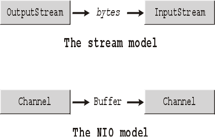
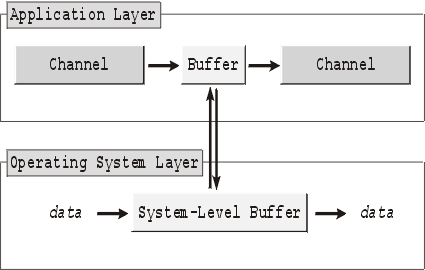

Non blocking IO in Java
=======================
 
 
 
 
 
 
 
 
 
Matej Lazar [matejonnet@gmail.com](matejonnet@gmail.com)

???

Visit [http://matejonnet.github.io/non-blocking-io-meets-concurrency-and-byteman/](http://matejonnet.github.io/non-blocking-io-meets-concurrency-and-byteman/) to see slides in presentation mode.

---

Agenda
======

### - Why non-blocking IO

### - Non-blocking IO principles

### - How to handle everything with a single thread

### - NIO2 Way

### - Higher level implementations

### - Multi-threading and Concurrency meets Byteman _(Ales)_

---

Why non-blocking IO
===================
- many long lived concurrent connections
    - web sockets
- 50k requests per second
- threads are considered resource-intensive

---

Non-blocking IO principles
==========================
- channels and buffers instead of stream (NIO)
    - do not block a thread waiting on IO
    - get notified when data is available
    - buffer-oriented model
        - deal with data in large blocks
    - See Javadoc _(ChannelExamples#fileChannel)_

---

Non-blocking IO principles #2
=============================
- OS-level facilities to maximize throughput
    - allocateDirect or MappedByteBuffer _(ChannelExamples#fileChannel)_
    - fileChannel.transferTo _(ChannelExamples#channelTransferTo)_

---

How to handle with a single thread
==================================

- selectors
    - to deal with a large number of data sources simultaneously
    - notifies when any I/O activity happens
    - "event loop"

- IO threads and worker threads

- see the example _(Server)_

---

NIO2 Way
========

- https://docs.oracle.com/javase/tutorial/essential/io/file.html
- Path and File
- AsynchronousSocketChannel & AsynchronousServerSocketChannel
- AsynchronousFileChannel
- ThreadPool & ExecutorService
    - control in which thread CompletionHandler callback is executed
        - [Fixed Thread Pool](./images/fixed-thread-pool.png)
        - [Cached and custom thread pool](./images/cached-and-custom-thread-pool.png)
- see the example _(AsynchronousExamples & AsynchronousExamplesJ8)_

---

Higher level implementations
============================

- Undertow http://undertow.io/ _(UndertowExample)_
    - lightweight Webserver
    - small dependency tree
- Netty http://netty.io/
    - easy to implement your own protocol
- Async Http Client
    - AsyncHttpClient https://github.com/AsyncHttpClient/async-http-client
    - Undertow

---

Multi-threading and Concurrency
===============================

Why being limited to a single thread

- IO thread pool
- Worker thread pool

---

Links
=====

### References

- [use select for high speed networking](http://www.javaworld.com/article/2073344/core-java/use-select-for-high-speed-networking.html)
- http://tutorials.jenkov.com/java-nio/nio-vs-io.html
- [asynchronous non blocking io java echo](http://www.programmingopiethehokie.com/2014/03/asynchronous-non-blocking-io-java-echo.html)
- [java nio channels asynchronoussocketchannel example](http://examples.javacodegeeks.com/core-java/nio/channels/asynchronoussocketchannel/java-nio-channels-asynchronoussocketchannel-example/)
- http://openjdk.java.net/projects/nio/presentations/TS-4222.pdf
- http://docs.oracle.com/javase/7/docs/technotes/guides/io/
- http://github.com/matejonnet/get-rid-of-boilerplate-with-j8/

### Presentation tool used
https://github.com/gnab/remark/

*Matej Lazar (matejonnet@gmail.com, mlazar@redhat.com)*
